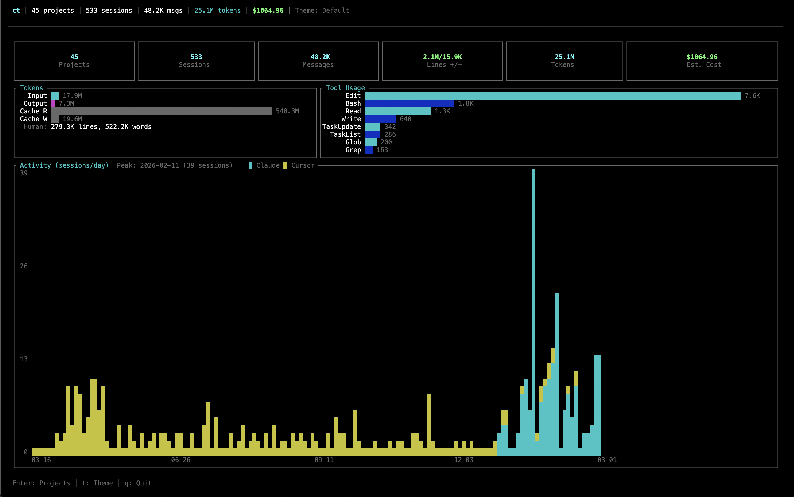
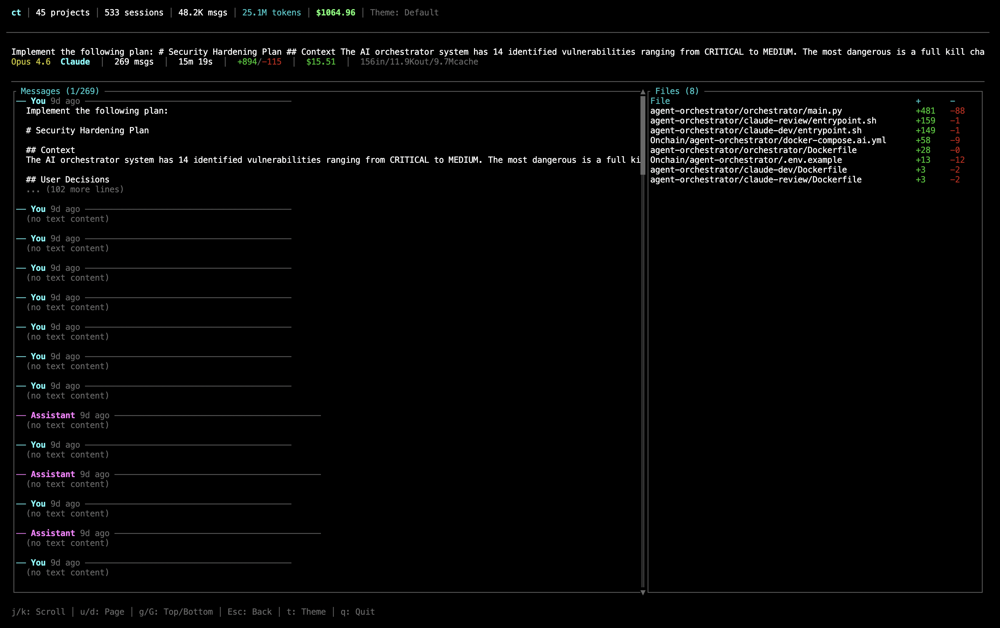

# VibeLens



A fast, interactive terminal UI for analyzing your [Claude Code](https://docs.anthropic.com/en/docs/claude-code) and [Cursor](https://cursor.com) usage across all your projects.

`ct` scans your local session data, merges Claude and Cursor activity by project folder, and presents rich metrics in a navigable TUI — or outputs them as a table or JSON.

## Features

- **Unified view** of Claude Code and Cursor sessions, merged by project directory
- **Dashboard** with aggregate stats: sessions, messages, tokens, cost estimates, tool usage, and a stacked activity chart (Claude vs Cursor)
- **Project list** with search (`/`), sortable columns (`s`), and source badges
- **Project detail** showing all sessions with first prompt, token counts, duration, model, and lines changed
- **Session detail** with a scrollable message thread alongside a file-changes panel
- **6 built-in themes**: Default, Dracula, Solarized, Nord, Monokai, Gruvbox — persisted across sessions
- **Background loading** with live progress so the TUI is responsive immediately
- **Parallel parsing** via Rayon for fast startup on large histories

## Install

### Option 1: One-line install (easiest)

**Linux / macOS** — installs the latest release to `~/.local/bin` (creates it if needed):

```sh
curl -sSL https://raw.githubusercontent.com/apetcu/vibelens/main/install.sh | sh
```

Use a different directory (e.g. `/usr/local/bin`):

```sh
curl -sSL https://raw.githubusercontent.com/apetcu/vibelens/main/install.sh | sh -s -- -d /usr/local/bin
```

**Windows (PowerShell)** — installs to `%LOCALAPPDATA%\vibelens\bin` and adds it to your user PATH:

```powershell
irm https://raw.githubusercontent.com/apetcu/vibelens/main/install.ps1 | iex
```

### Option 2: Download a release

Download the binary for your platform from the [Releases](https://github.com/apetcu/vibelens/releases) page, put it on your `PATH`, and optionally rename to `ct` (or `ct.exe` on Windows).

| Platform        | Asset                |
|----------------|----------------------|
| Linux x86_64   | `ct-linux-x86_64`    |
| macOS (Apple Silicon) | `ct-macos-aarch64` |
| macOS (Intel)  | `ct-macos-x86_64`    |
| Windows x86_64 | `ct-windows-x86_64.exe` |

### Option 3: Build from source

Requires Rust 1.70+.

```sh
git clone https://github.com/apetcu/vibelens.git
cd vibelens
cargo install --path .
```

This installs the `ct` binary.

## Usage

```
ct              # launch interactive TUI (default)
ct --cli        # print a summary table to stdout
ct --json       # output all metrics as JSON
```

## Session Details


## TUI Navigation

| Key | Action |
|---|---|
| `1` `2` `3` `4` | Jump to Dashboard / Projects / Detail / Session |
| `Enter` / `l` | Drill into selection |
| `Esc` / `h` | Go back |
| `j` / `k` or `↑` / `↓` | Move up / down |
| `u` / `d` | Page up / down |
| `g` / `G` | Jump to top / bottom |
| `/` | Search projects by name or path |
| `s` | Cycle sort column |
| `t` | Cycle theme |
| `q` | Quit |

## Views

### Dashboard

Stat cards (projects, sessions, messages, tokens, cost), token breakdown bars, human contribution metrics, top tool usage, and a stacked bar chart of daily activity split by Claude vs Cursor.

### Project List

Filterable, sortable table. Columns: Name, Sessions, Messages, Tokens, Lines +/−, Cost, Last Active. Source badges show whether data comes from Claude, Cursor, or both. Model names are color-coded (Opus, Sonnet, Haiku).

### Project Detail

Header with project name, model, source, and path. Summary row of key metrics. Session table with first prompt preview, message count, tokens, duration, lines changed, model, and relative timestamp.

### Session Detail

Compact info header, a scrollable message thread (left, 65%), and a file-changes panel (right, 35%) showing files touched with lines added/removed.

## Data Sources

`ct` reads data from:

- **Claude Code** — JSONL session files under `~/.claude/projects/`
- **Cursor** — SQLite workspace databases and conversation logs

Projects from both sources are merged when they point to the same directory on disk.

## Metrics Tracked

| Category | Details |
|---|---|
| Tokens | Input, output, cache read, cache creation |
| Cost | Estimated from model + token counts |
| Messages | Per-session conversation turns |
| Lines | Added / removed per session and per file |
| Tools | Function/tool call counts (e.g. Read, Edit, Bash) |
| Human input | Lines, words, and characters you wrote |
| Models | Opus, Sonnet, Haiku identification |
| Timeline | Daily session counts split by source |

## Themes

Press `t` to cycle. Your choice is saved to `~/.config/claude-tracker/theme`.

- Default (terminal colors)
- Dracula
- Solarized
- Nord
- Monokai
- Gruvbox

## Project Structure

```
cli/
├── src/
│   ├── main.rs             # CLI args, async data loading, TUI setup
│   ├── tui_app.rs          # App state, navigation, filtering, sorting
│   ├── tui_ui.rs           # All TUI rendering (dashboard, lists, details)
│   ├── tui_events.rs       # Keyboard event handling
│   ├── theme.rs            # Theme definitions (6 themes, RGB colors)
│   ├── scanner.rs          # Claude project discovery
│   ├── cursor_scanner.rs   # Cursor workspace discovery
│   ├── parser.rs           # Claude session JSONL parsing
│   ├── cursor_parser.rs    # Cursor session parsing
│   ├── metrics.rs          # Aggregation and timeline computation
│   ├── models.rs           # Core data structures
│   ├── display.rs          # --cli table and --json output
│   └── format.rs           # Number, duration, cost formatting
└── Cargo.toml
```

## License

MIT
